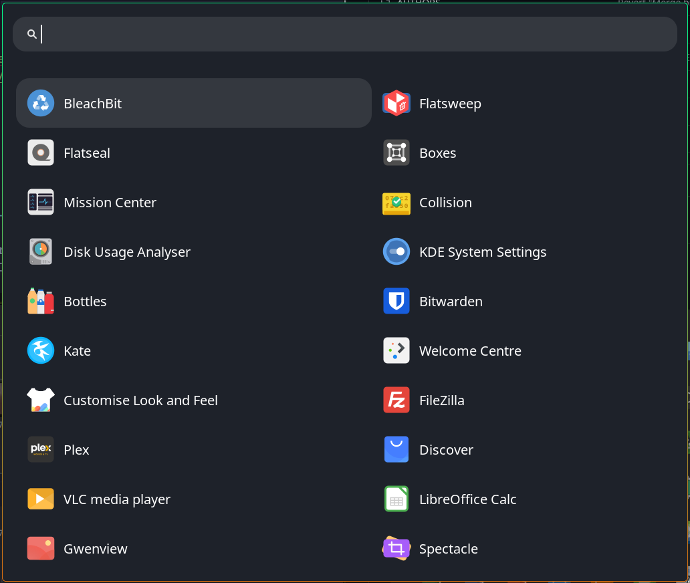
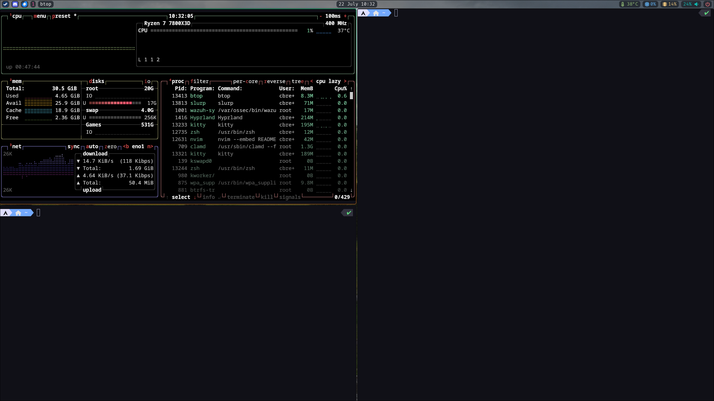

# dotfiles

**Designed to be used on Arch linux
Script needs to be ran as sudo**

## Assumptions
Tela icon pack installed to /usr/share/icons/
Breeze-Dark theme pack installed to /usr/share/themes/

## Usage

1. clone the repository
2. cd into dotfiles
3. run `sudo ./install.sh`

## Dependencies
- hyprland
- waybar
- wayland
- gtk3
- qt5
- dunst
- swww
- plasma-meta

### Final Product

1. Wofi

2. Waybar

3. Notifications

4. Desktop

