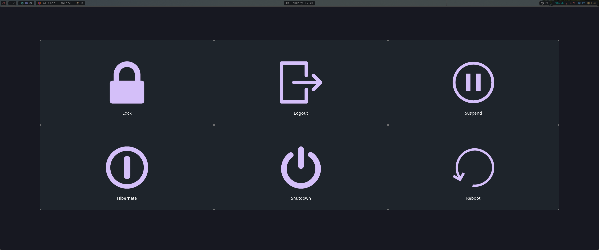

# dotfiles

**Designed to be used on Arch linux**

You're installing this at your own risk, take backups of your config files before running any script from here

## Assumptions
Tela icon pack installed
Breeze theme pack installed

## Usage
1. run `sudo pacman -S git stow --needed`
2. clone the repository
3. cd into dotfiles
4. run `./install.sh` 

## Dependencies
- git
- stow
- hyprland
- waybar
- wayland
- gtk3/4
- dunst
- swww
- wlogout

### Final Product

1. Wofi

2. Waybar

3. Notifications

4. Desktop

5. wlogout

