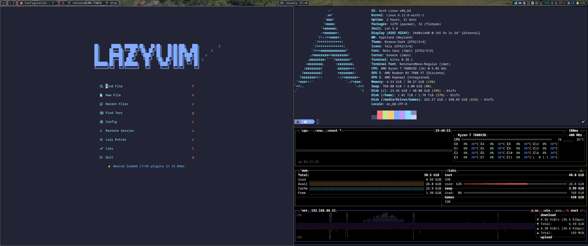

# dotfiles

** Designed to be used on Arch linux

## Assumptions
Tela icon pack installed
Breeze theme pack installed

## Usage

1. clone the repository
2. cd into dotfiles
3. run `./install.sh`

## Dependencies
- hyprland
- waybar
- wayland
- gtk3
- qt5
- dunst
- swww
- wlogout

### Final Product

1. Wofi

2. Waybar

3. Notifications

4. Desktop

# To Do
1. Fully implement hyprlock
2. Remove remaining KDE dependencies (looking at you kscreenlocker)
3. Write a proper install script 
4. Review comments in existing script/configs
