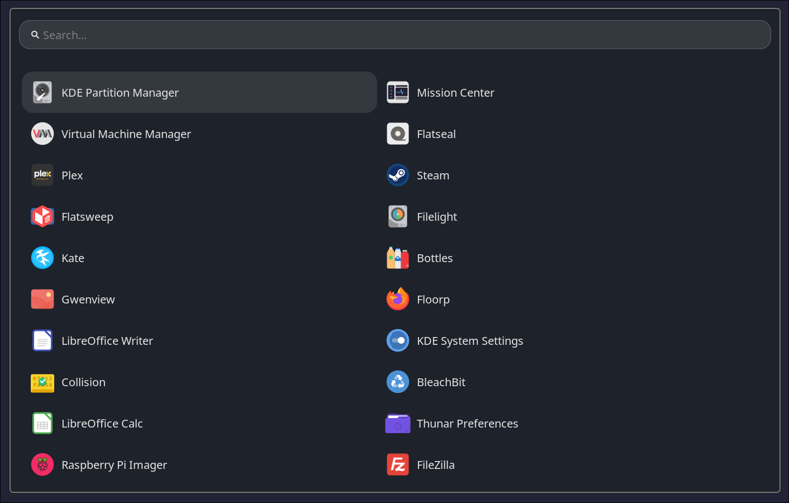

# dotfiles

**Designed to be used on Arch Linux with the Hyprland desktop**

You're installing this at your own risk, take backups of your configs files before running any script from here and do your due diligence!

## Assumptions
Following theme packs are installed:
 - Tela icon 
 - Breeze theme

Following packages are installed:
 - git
 - hyprland

## Usage
1. run `sudo pacman -S git stow --needed`
2. clone the repository
3. cd into dotfiles
4. run `./install.sh` 

## Dependencies
- git
- stow
- hyprland
- waybar
- wayland
- gtk3/4
- dunst
- swww
- wlogout

### Final Product

1. Wofi

2. Waybar

3. Notifications

4. Desktop

5. wlogout

